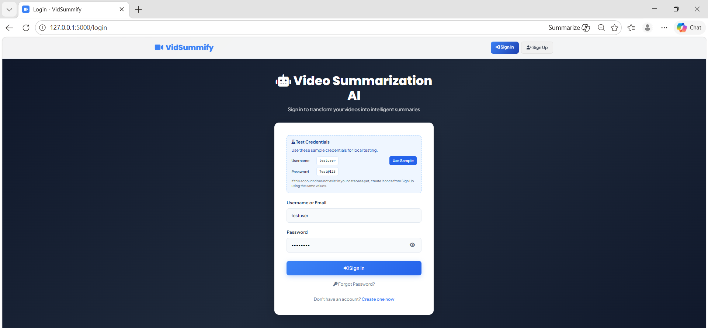
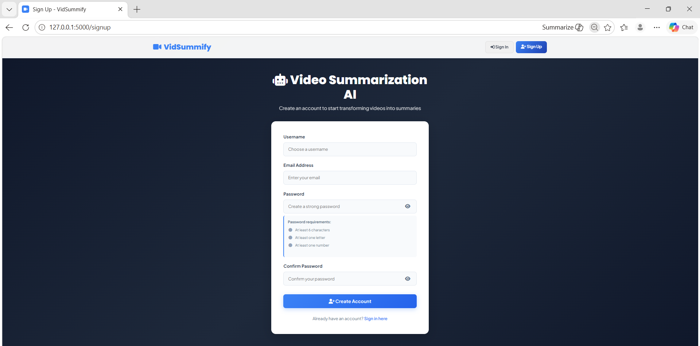
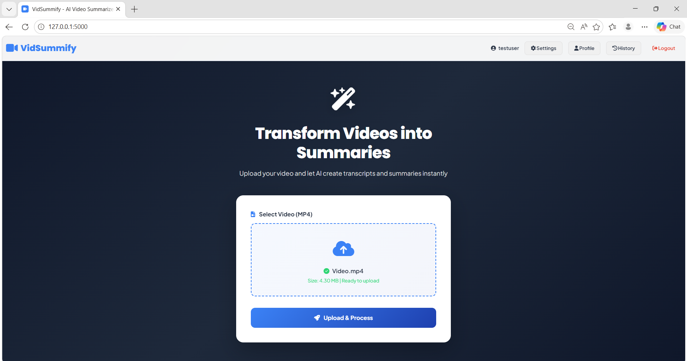
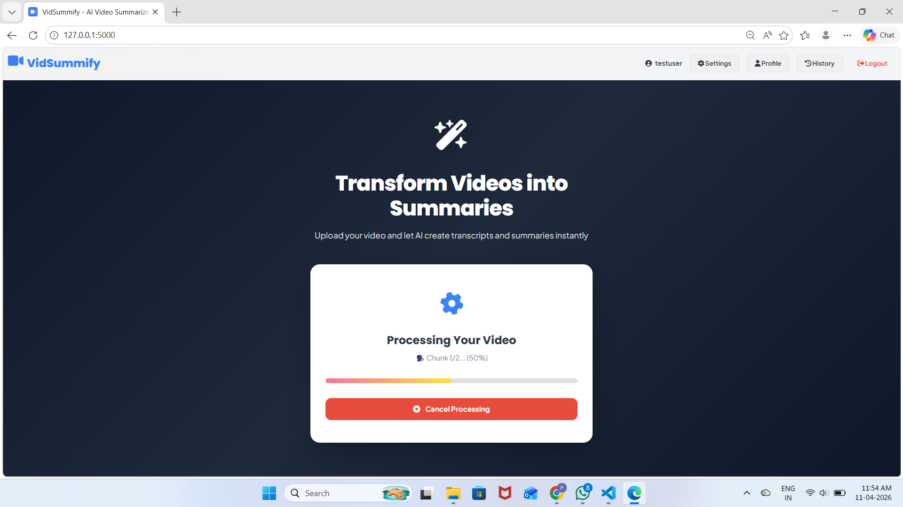
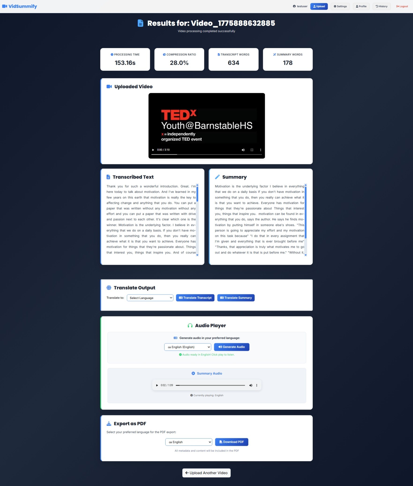
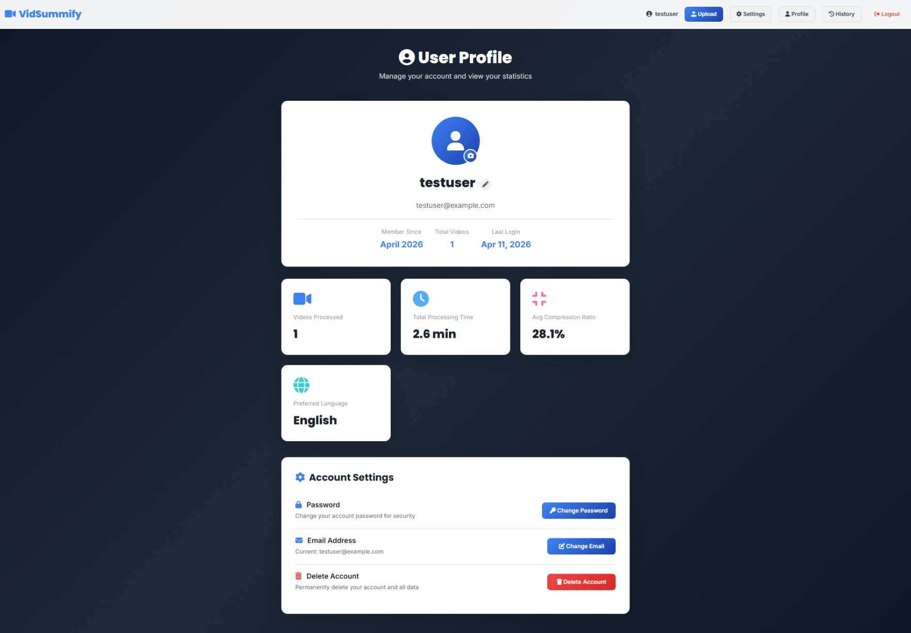
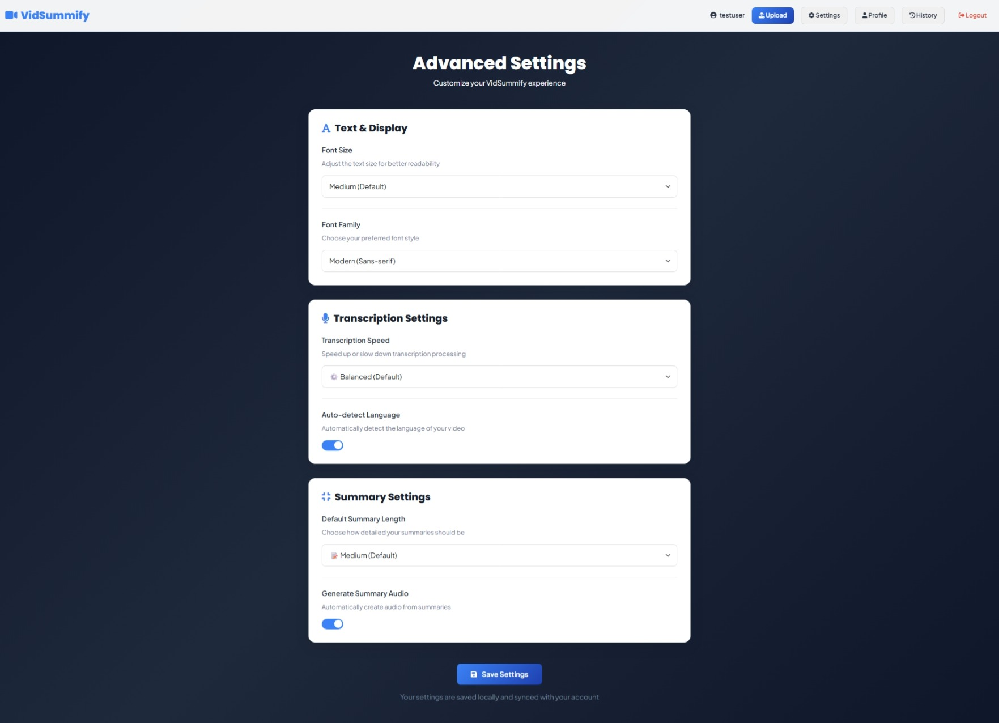
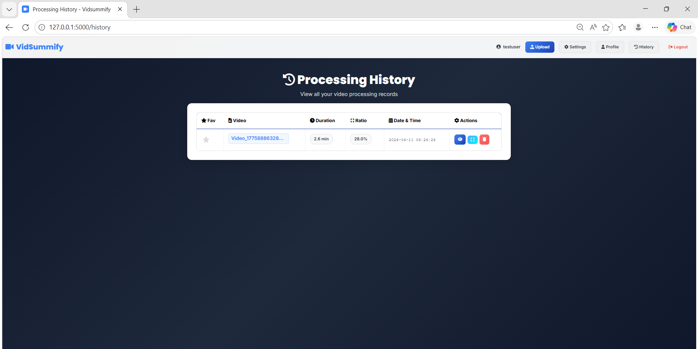

# Vidsummify

Vidsummify is a Flask-based web app that converts uploaded videos into transcript, summary, translated text, and audio output.

## Features

- User authentication
- Video upload and processing
- Speech-to-text transcription
- AI summary generation
- Translation and text-to-speech
- History, profile, and settings pages
- PDF export support

## Tech Stack

- Python, Flask
- SQLAlchemy, Flask-Login
- Faster-Whisper, Transformers
- MoviePy, FFmpeg, PyDub, gTTS

## Quick Setup

```bash
git clone https://github.com/parthikrishh/Vidsummify.git
cd Vidsummify
python -m venv .venv
```

Windows:

```powershell
.\.venv\Scripts\Activate.ps1
```

Linux/macOS:

```bash
source .venv/bin/activate
```

Install dependencies and run:

```bash
pip install -r requirements.txt
copy .env.example .env
python init_db.py
python app.py
```

App URL:

- http://127.0.0.1:5000

## Screenshots

### 1) Sign In Page / Sign Up Page



### 2) Sign Up Page



### 3) Upload Video Page



### 4) Processing



### 5) Result Page



### 6) User Profile Page



### 7) Setting Page



### 8) History Page



## Author

- Parthiban K B
- GitHub: https://github.com/parthikrishh
- Linked in: www.linkedin.com/in/parthikrishh

## License

For academic and learning purpose.


